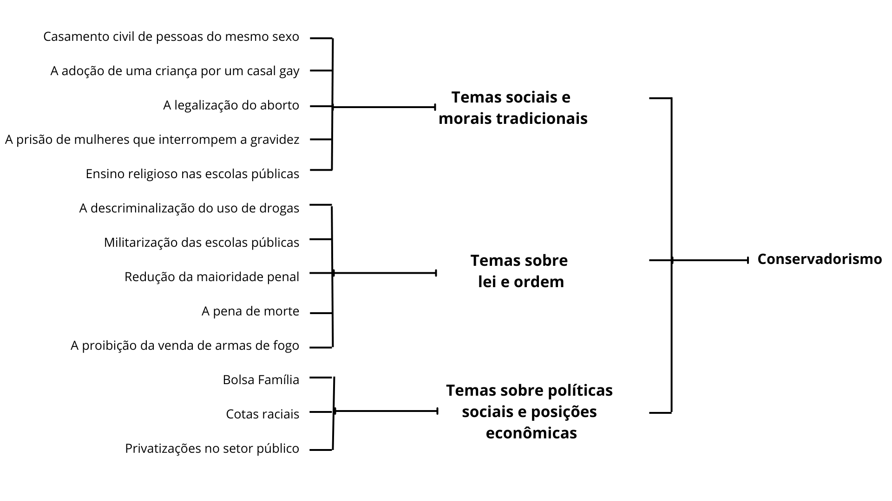
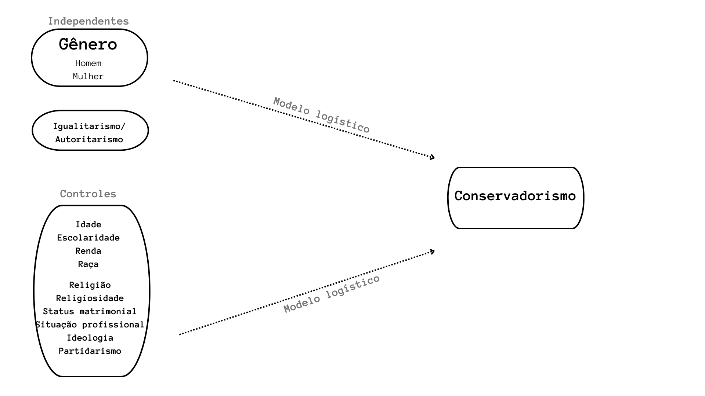
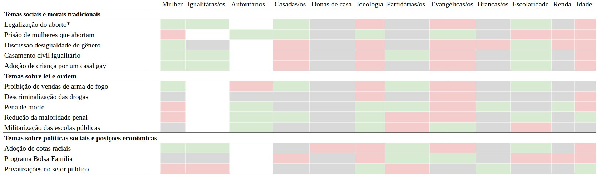
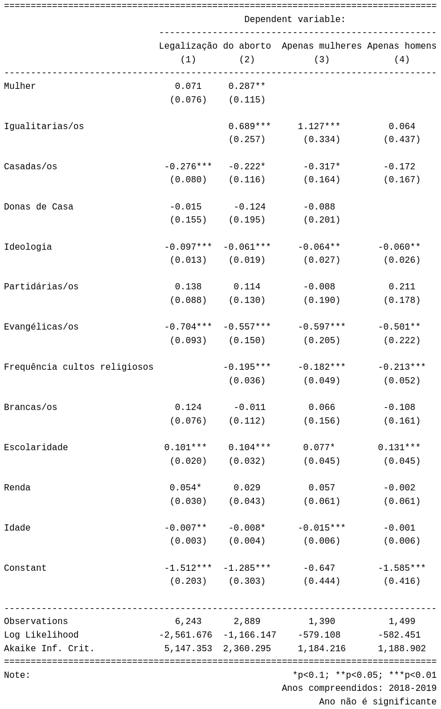
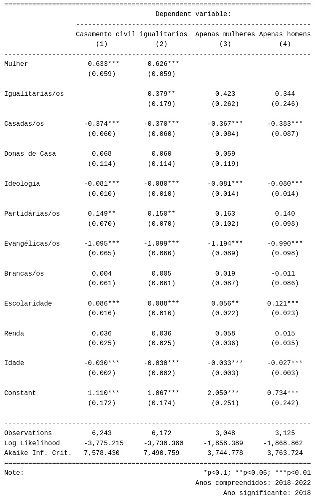
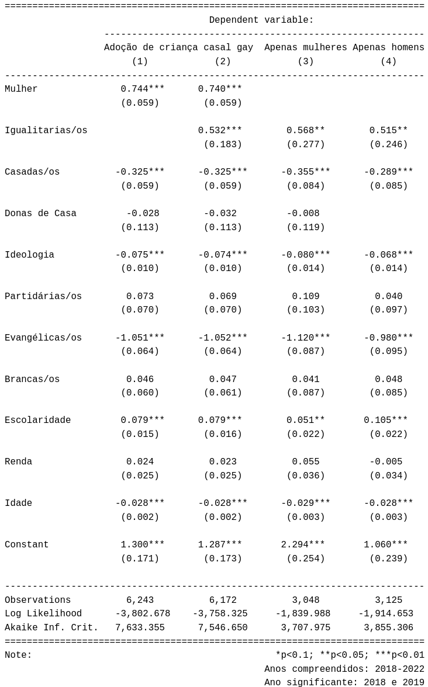
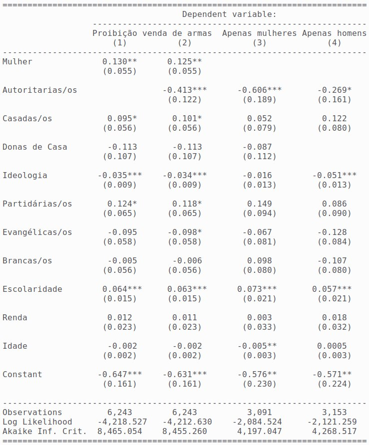
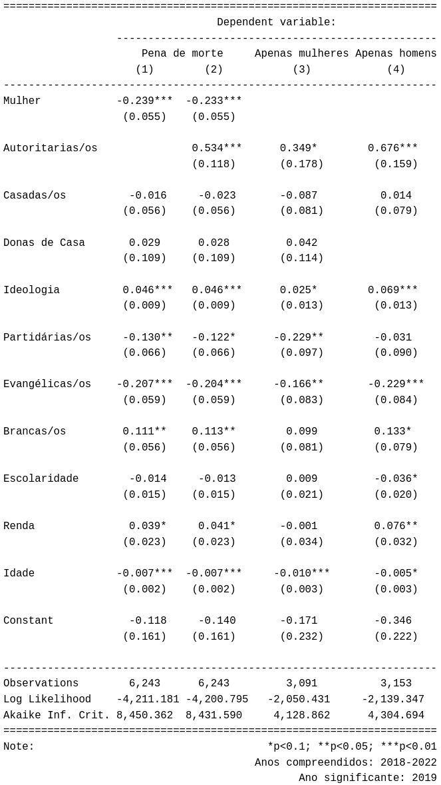
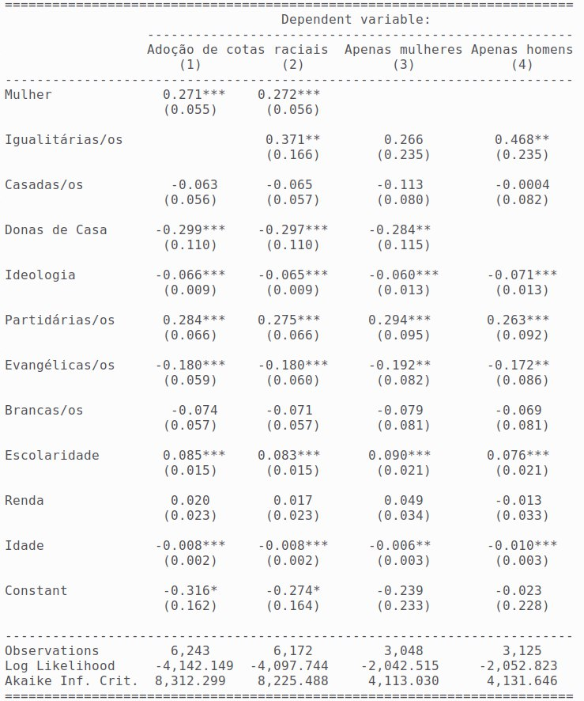

```{r,echo=FALSE}

knitr::opts_chunk$set(
  echo = FALSE, fig.align = "center", message = FALSE,  warning = FALSE, cache = TRUE)

pacman::p_load(tidyverse, rio, kableExtra, stargazer)

# Banco geral

load("~/dissertacao_cara_da_democracia/1.bancos/b_modelos.Rda")

```

# Desenho de pesquisa
--

### Perguntas 
--

- Existe diferença nas atitudes políticas de mulheres e homens?

--
- Em quais atitudes polítias homens e mulheres divergem?
--

- Qual a direção dessa variação? 


### Objetivo

Analisar se existe diferença de gênero nas atitudes relacionadas às temáticas do conservadorismo multidimensional brasileiro.


--

Além disso, buscou-se


investigar se há um efeito de gênero nas atitudes quando o modelo estatístico abarca questões como valores igualitários, atitudes autoritárias, religiosidade, ocupação, status matrimonial, ideologia e partidarismo quando controladas por idade, renda, escolaridade e raça.

---
### Hipóteses

  1. O gênero (ser mulher) exerce um efeito positivo em posições favoráveis a legalizaçãdo do aborto e aos direitos de grupos LGBTQ+;
  
  2. O gênero (ser mulher) exerce um efeito negativo em posições favoráveis a proibição de venda de armas de fogo, descriminalização das drogas e a pena de morte;
  
  3. O gênero (ser mulher) exerce um efeito positivo em posições favoráveis às cotas raciais e ao programa Bolsa Família;
  
  4. Valores igualitários exercem um efeito positivo nas atitudes progressistas, o que diminui o gap entre homens e mulheres.

---

### Capítulo 1. Conservadorismo: histórico e conceito

Objetivo: abordar as definições dos conceitos trazidos na dissertação; definir as tensões e atores protaginistas da agenda conservadora no cenário político nas últimas três décadas.

--
- 1.1 Ideologias políticas à direita
- 1.2 A ascensão da nova direita no Brasil: um novo amálgama de ideologias políticas (1946-2006)
- 1.3 Conservadorismo, a direita cristã e a agenda de gênero

---
### Capítulo 2. Diferenças de gênero na opinião pública

Objetivo: desenvolver um quadro analítico capaz de examinar os fatores que levam as eleitoras e os eleitores a manifestarem certas posições acerca de atitudes políticas e políticas públicas.

- 2.3 Abordagens teóricas para diferenças de gênero em opiniões e atitudes políticas

-- 2.3.1 Feminismo

-- 2.3.2 Circunstâncias econômicas

-- 2.3.3 Papel Social

-- **2.3.4 Valores**

--- **2.3.4.1 Igualitarismo**

--- **2.3.4.2 Autoritarismo**

-- 2.3.5 Partidarismo, situação ocupacional e religião


---
## Metodologia

Variável independente chave: **gênero**.

Um conservadorismo multidimensional = treze variáveis dependentes. 

```{r out.height = "380px", out.width='700px', echo=F}

```

---
```{r out.height = "580px", out.width='900px', echo=F}

```

---
class: title-slide-custom, center

<br><br><br><br><br><br><br><br><br>

# Resultados 
---

### Tabela resumo dos efeitos


```{r out.height = "400px", out.width='2000px', echo=F, fig.align='center'}

```
**Nota:** Cor verde indica efeito positivo, vermelha indica efeito negativo, cinza ausência de significância estatística e branca quando a variável não é mensurada no modelo.
---

```{r out.height = "500px", out.width='2000px', echo=F, fig.align='center'}
knitr::include_graphics("tabela_resumo_efeitos_genero.jpg")
```
**Nota:** Cor verde indica efeito positivo, vermelha indica efeito negativo, cinza ausência de significância estatística e branca quando a variável não é mensurada no modelo.

---
class: title-slide-custom, center

<br><br><br><br><br><br><br><br><br>
## Temas sociais e morais tradicionais

---
```{r out.height = "680px", out.width='450px', echo=F, fig.align='center'}

```

---
```{r out.height = "680px", out.width='450px', echo=F, fig.align='center'}

```

---
```{r out.height = "680px", out.width='450px', echo=F, fig.align='center'}

```

---
#### Probabilidades preditas: adoção de crianças por um casal gay
```{r out.height = "500px", out.width='700px', echo=F, fig.align='center'}
knitr::include_graphics("prob_pred_casamento_gay.png")
```

---
class: title-slide-custom, center

<br><br><br><br><br><br><br><br><br>
## Temas sobre lei e ordem

---
```{r out.height = "630px", out.width='450px', echo=F, fig.align='center'}

```
---

```{r out.height = "680px", out.width='450px', echo=F, fig.align='center'}

```
---
class: title-slide-custom, center

<br><br><br><br><br><br><br><br><br>
## Temas sobre políticas sociais e posições econômicas

---
```{r out.height = "630px", out.width='450px', echo=F, fig.align='center'}

```

---
# Considerações finais

- Onde há o maior e mais consistente gap entre homens e mulheres são nos temas relacionados aos homossexuais. São 15 e 13 pontos percentuais que separam as opiniões favoráveis sobre a adoção de crianças por um casal gay e o casamento civil igualitário, respectivamente. Nas multivariadas, o efeito do gênero não é substancialmente diminuído com a adição de outros fenômenos importantes para o tema como valores igualitários.

- Ser mulher, quando comparado aos homens, esta relacionado a maiores chances de apoio a legalização do aborto; do fomento da discussão sobre desigualdade de gênero; da proibição de vendas de armas e a adoção de cotas raciais.  

- Em contrapartida, ser mulher está relacionado a menores chances de apoio a prisão de mulheres que abortam; a pena de morte; a redução da maioridade penal e as privatizações no setor público.

- Homens e mulheres não divergem sobre a descriminalização das drogas, militarização das escolas públicas e nas opiniões sobre o programa bolsa família.

--
- **Mulheres parecem manifestar atitudes voltadas ao espectro progressista, ou seja, elas parecem estar um pouco menos ligadas às temáticas que caracterizam um conservador clássico do país nos últimos cinco anos.**


---
# Obrigada!
